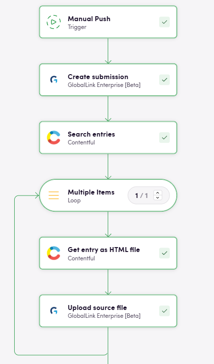
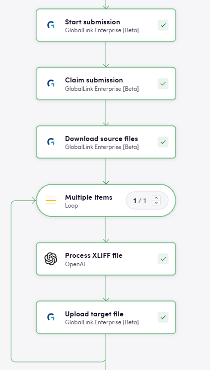
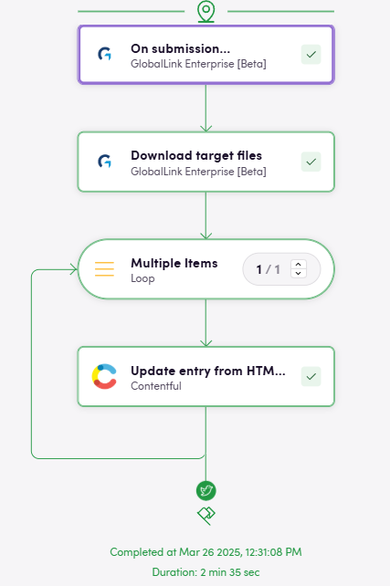

# Blackbird.io GlobalLink Enterprise

Blackbird is the new automation backbone for the language technology industry. Blackbird provides enterprise-scale automation and orchestration with a simple no-code/low-code platform. Blackbird enables ambitious organizations to identify, vet and automate as many processes as possible. Not just localization workflows, but any business and IT process. This repository represents an application that is deployable on Blackbird and usable inside the workflow editor.

## Introduction

<!-- begin docs -->

GlobalLink is a cloud-based, vendor-agnostic technology platform that optimizes translation management for Enterprise and SMB companies. It helps users in delivering and maintaining multilingual websites quickly and affordably. GlobalLink provides a comprehensive solution for creating, managing, and delivering multilingual content across various platforms.

With the `GlobalLink Enterprise` app for Blackbird, you can automate your translation workflows by creating submissions, uploading files for translation, monitoring submission statuses, downloading translated content, and integrating these operations with other business processes.

## Before setting up

Before you can connect to `GlobalLink Enterprise` through Blackbird, you need to make sure that:

- You have a GlobalLink account with appropriate access permissions
- You know your GlobalLink API endpoint URL
- You have a valid username and password for authentication
- You have a Basic Auth Token for API access

## Connecting

1. Navigate to apps and search for **GlobalLink Enterprise**
2. Click _Add Connection_
3. Name your connection for future reference e.g., 'My GlobalLink'
4. Fill in the following fields:
   - **Base URL**: Your GlobalLink API endpoint (e.g., `https://api.globallink.com`)
   - **Username**: Your GlobalLink username
   - **Password**: Your GlobalLink password
   - **Basic auth token**: Your GlobalLink API Basic Auth token
5. Click _Connect_
6. Confirm that the connection has appeared and the status is _Connected_

## Actions

### Submission management

- **Create submission**: Creates a new translation submission with specified source and target languages, project details, due date, and optionally configures webhooks for status notifications.
> **Important**: When creating a submission, you can set the `Target format` parameter. By default it's set to `TXLF`, which is GlobalLink's recommended format. This converts supported files to TXLF format (XLIFF 1.2 with GlobalLink extensions) which you'll receive when downloading source files. If you prefer to work with original file formats, set `Target format` to `Non parsable`.
- **Get submission**: Retrieves detailed information about a specific submission using its ID.
- **Start submission**: First analyzes and then starts a submission, initiating the translation workflow process.
- **Claim submission**: Claims a submission for processing at a specific phase.

### File management

- **Upload source file**: Uploads a source file to a submission for translation.
- **Upload reference file**: Uploads a reference file to a submission on submission level. Reference files provide context for translators.
- **Upload target file**: Uploads a translated file to a submission and waits for the process to finish successfully. 

  > Important: The file name must not be modified in any way. It is encoded in the filename and is essential for the upload process to work correctly.

- **Download source files**: Downloads source files from a submission at a specific phase.
- **Download target files**: Downloads translated files from a completed submission.

## Events

GlobalLink Enterprise app provides polling-based events for monitoring submissions:
- **On submission created**: A polling event that periodically checks for new submissions. This event triggers only for submissions with the status `Active` that have been claimed by the user, ensuring they're ready for translation processing.
- **On submission completed**: A polling event that periodically checks for completed submissions. If completed submissions are found, the event is triggered.

## Translation workflow automation

A typical **GlobalLink Enterprise** translation workflow in Blackbird might include:

1. Creating a submission with appropriate source and target languages
2. Uploading source content files to the submission
3. Optionally adding reference materials to assist translators
4. Starting the submission to begin the translation process
5. Claiming the submission for processing
6. Using polling events to monitor the submission status

For effective automation, you'll typically need to create two additional birds with the **On submission callback received** event:

- **First bird (or checkpoint)**: Triggered by `On submission created` event
  - Download source files
  - Translate them using your preferred translation app (e.g., DeepL)
  - Upload the translated files back to the submission

- **Second bird (or checkpoint)**: Triggered by `On submission completed`
  - Download the finalized translated files
  - Process them as needed (e.g., upload to a CMS, notify stakeholders)

This workflow allows for fully automated end-to-end translation processing with minimal manual intervention.

## Example

Here's a simple example of how to set up a translation workflow with `GlobalLink Enterprise` and `Contentful` CMS:

### Part 1: Submission creation and source upload

### Part 2: Starting the submission and translation processing

### Part 3: Delivery to CMS

This bird uses `On submission completed` checkpoint to trigger once the translation is finished. It downloads the translated files and pushes them to a Contentful CMS.

## Feedback

Do you want to use this app or do you have feedback on our implementation? Reach out to us using the [established channels](https://www.blackbird.io/) or create an issue.

<!-- end docs -->
